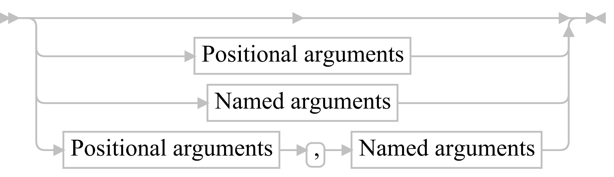
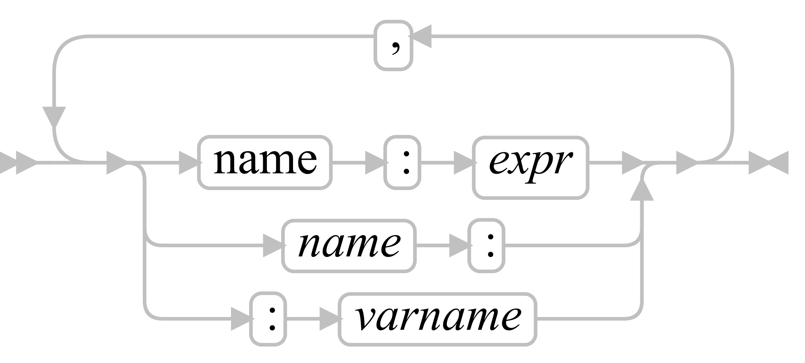

Experimental ooRexx
===================
Forked from http://sourceforge.net/projects/oorexx/

- incubator/DocMusings
- incubator/ooRexxShell
- sandbox/jlf

DocMusings provides a set of scripts to convert the ASCII railroads of the ooRexx documentation to [graphical syntax diagrams][doc].

The experimental ooRexx interpreter implemented in sandbox/jlf is described by this [pdf][slides] and can be downloaded [here][download].

Miscellaneous notes:

- [Sandbox diary][sandbox_diary]
- [DocMusings][doc_musings_diary]
- [Doc XML transformation][doc_transformation_diary]
- [Railroad][railroad_diary]
- [Internal notes][internal_notes]
- [Instructions to build Executor from scratch][build_executor]

Examples of extensions
----------------------

### Named arguments

A positional argument list is a serie of optional expressions, separated by commas.

    caller: put("one", 1)
    callee: use arg item, index -- order is important

The position of each argument within the argument list identifies the corresponding
parameter in the parameter list of the routine/method being invoked.

This is in contrast to named argument lists, where the correspondence between
argument and parameter is done using the parameter's name.

    caller: put(index:1, item:"one")
    callee: use named arg item, index -- order is not important

Specification of named arguments: [spec][named_arguments_spec]

Test cases of named arguments: [script][named_arguments_test_cases_script], [output][named_arguments_test_cases_output]

#### Caller side

Positional and named arguments can be used in the same call.  
Named arguments are after the last positional argument.

    caller: "one two three one"~reduce("put", by:"word", initial:.set~new)

Arguments:

Positional arguments:

Named arguments:

#### Called side

    use strict arg doer
    use strict named arg by, initial
    
The named arguments are declared separately from the positional arguments.

### Blocks (source literals)

A RexxBlock is a piece of source code surrounded by curly brackets.

Routine

    {use arg name, greetings
     say "hello" name || greetings
    }~("John", ", how are you ?")       -- hello John, how are you ?

Coactivity

A coactivity remembers its internal state.  
It can be called several times, the execution is resumed after the last executed .yield[].

    nextInteger = {::coactivity loop i=0; .yield[i]; end}
    say nextInteger~()                  -- 0
    say nextInteger~()                  -- 1
    nextInteger~makeArray(10)           -- [2,3,4,5,6,7,8,9,10,11]
    say nextInteger~()                  -- 12
    ...

Closure

A closure remembers the values of the variables defined in the outer environment of the block.  
Updating a variable from the closure will have no impact on the original context (closure by value).

    v = 1                                -- captured
    {expose v ; say v}~()      -- 1

### Array initializer

Initializer (instance method ~of) which takes into account the dimensions of the array.  
Inspired by [APL][apl_glimpse_heaven]

If there is only one argument, and this argument has the method ~supplier then each item returned by the argument's supplier is an item.

    .array~new(2,3)~of(1~upto(6))
    1 2 3
    4 5 6

If there is only one argument, and this argument is a doer, then the doer is called for each cell to initialize.  
Implicit arguments :

- arg(1) : item : position of the current cell, from 1 to size.
- arg(2) : index : position of the current cell, in each dimension.

The value returned by the doer is the item for the current cell.

    .array~new(2,3)~of{10*item}
    10 20 30
    40 50 60

Otherwise each argument is an item as-is.

    .array~new(2,3)~of(1,2,3,4,5,6)
    1 2 3
    4 5 6

If some arguments are omitted, then the corresponding item in the initialized array remains non-assigned.

    .array~new(2,3)~of(1,,3,,5,6)
    1 . 3
    . 5 6

Rules inspired by APL :  
If there are too many items, the extra items are ignored.  
If there are fewer items than implied by the dimensions, the list of items is reused as
many times as necessary to fill the array.

    .array~new(2,3)~of(1,2)
    1 2 1
    2 1 2

Generation of an identity matrix (1 on the diagonal, 0 everywhere else).  
Works for any shape with rank >= 2.  
When all the items of an index are equal then it's a diagonal index.

- [1,1] is a diagonal index.
- [1,2] is not a diagonal index.

This can be tested by converting the index to a set and testing if the number of items is 1.

    .array~new(3,3)~of{ index~reduce(.set~new, "put")~items==1 }=
    1 0 0
    0 1 0
    0 0 1

### Array programming

Thanks to the support of alternative messages for binary operators, it's now possible to provide symetric implementations of binary operators.  

    arg1 ~ "+"( arg2 )

If arg1 doesn't know how to process the message "+" (either because the message itself is not understood, or because the type of arg2 is not supported) then the interpreter sends this alternative message :

    arg2 ~ "+OP:RIGHT"( arg1 )

If arg2 doesn't know how to process the message "+OP:RIGHT" (either because the message itself is not understood, or because the type of arg1 is not supported) then the interpreter raises an exception for the traditional message "+", not for the alternative message. That way, legacy programs are not impacted by this extension of behaviour.  
There is no performance penalty because the interpreter sends the alternative message only when the traditional implementation fails. So the optimized implementations of String | NumberString | Integer operators continue to be fully optimized.

Examples :

    a = .array~of(10,20,30)
    100 a=                  -- ['100 10','100 20','100 30'] instead of '100 an Array'
    a 100=                  -- ['10 100','20 100','30 100']
    100 || a =              -- [10010,10020,10030]          instead of '100an Array'
    a || 100 =              -- [10100,20100,30100]

    ts1day = .TimeSpan~fromDays(1)                  -- (1.00:00:00.000000)
    ts1hour = .TimeSpan~fromHours(1)                -- (01:00:00.000000)
    date = .datetime~new(2013,1,10, 12, 30, 10)     -- (2013-01-10T12:30:10.000000)
    date + .array~of(ts1hour, ts1day)=              -- [(2013-01-10T13:30:10.000000),(2013-01-11T12:30:10.000000)]

    a = .array~of(10, 20, 30)
    b = .array~of(5, a, 5+6i)
    c = .array~of(15+16i, b, 15)
    100 - a =                                       -- [90, 80, 70]
    100 - b =                                       -- [95, [90, 80, 70], 95-6i]
    100 - c =                                       -- [85-16i, [95, [90, 80, 70], 95-6i], 85]
    (100+200i) * a =                                -- [1000+2000i, 2000+4000i, 3000+6000i]
    (100 + 200i) * b =                              -- [500+1000i, [1000+2000i, 2000+4000i, 3000+6000i], -700+1600i]
    (100 + 200i) * c =                              -- [-1700+4600i, [500+1000i, [1000+2000i, 2000+4000i, 3000+6000i], -700+1600i], 1500+3000i]

### Coactivity / Inverse a recursive algorithm into an iterative one

Producer/consumer problems can often be implemented elegantly with coactivities.  
Coactivities also provide an easy way to inverse recursive algorithms into iterative ones.  
Illustration with a binary tree.

    btree = .BinaryTree~of(4, 6, 2, 7, 5, 3, 1)
    ascending = btree~visitAscending
    descending = btree~visitDescending
    do btree~items
        say ascending~()
        say descending~()
    end
    .coactivity~endAll

    ::requires "extension/extensions.cls"

Class Node

The binary tree stores items in nodes.  
Each node holds an item.  
Each node has a reference to a node on the left and a reference to a node on the right.  
Items smaller than current node's item are stored in the left-side subtree, and larger items are stored in the right-side subtree.

    ::class Node private

    ::attribute leftNode
    ::attribute rightNode
    ::attribute item

    ::method init
        self~leftNode = .nil
        self~rightNode = .nil
        self~item = .nil

    ::method insert
        use arg item
        select
            when self~item == .nil then do
                self~item = item
            end
            when item < self~item then do
                if self~leftNode == .nil then self~leftNode = self~class~new
                self~leftNode~insert(item)
            end
            otherwise do
                if self~rightNode == .nil then self~rightNode = self~class~new
                self~rightNode~insert(item)
            end
        end

    ::method visitAscending unguarded
        if self~leftNode <> .nil then self~leftNode~visitAscending
        .yield[self~item]   -- can be executed only in the context of a coactivity
        if self~rightNode <> .nil then self~rightNode~visitAscending

    ::method visitDescending unguarded
        if self~rightNode <> .nil then self~rightNode~visitDescending
        .yield[self~item]   -- can be executed only in the context of a coactivity
        if self~leftNode <> .nil then self~leftNode~visitDescending

Class BinaryTree

    ::class BinaryTree public

    ::method of class
        use arg item, ...
        binaryTree = self~new
        do i = 1 to arg()
            binaryTree~insert(arg(i))
        end
        return binaryTree

    ::attribute rootNode private
    ::attribute items

    ::method init
        self~rootNode = .Node~new
        self~items = 0

    ::method insert
        self~items += 1
        forward to (self~rootNode)

    ::method visitAscending
        -- the message "visitAscending" is sent to self~rootNode, in the context of a coactivity
        return .Coactivity~new("visitAscending", false, self~rootNode)

    ::method visitDescending
        -- the message "visitDescending" is sent to self~rootNode, in the context of a coactivity
        return .Coactivity~new("visitDescending", false, self~rootNode)

### Closures / Value capture

[Rosetta Code][rosetta_code_closures_value_capture]

    a = .array~new
    do i=1 to 10
        a~append{expose i; return i*i}
    end
    do i=1 to 9
        say a[i]~()
    end

A more compact code... item is an implicit parameter.

    1~upto(10){ {expose item; return item * item} } ~ take(9) ~ each{ say item~() }

### Accumulator factory

[Rosetta Code][rosetta_code_accumulator_factory]

    accumulator = {
        use arg sum
        return  {
            expose sum
            use arg n
            sum += n
            return sum
        }
    }

    x = accumulator~(1) -- an accumulator (closure), sum initialized to 1
    x~(5)               -- add 5 to sum
    accumulator~(3)     -- another accumulator (closure), no effect on x
    say x~(2.3)         -- add 2.3 to sum and print the current sum : 8.3

### Function composition

[Rosetta Code][rosetta_code_function_composition]

    compose = {
        use arg f, g
        return {
            expose f g
            use arg x
            return f~(g~(x))
        }
    }

    double = { return 2 * arg(1) }
    negative = { return -arg(1) }
    say compose~(negative, double)~(5)  -- -10

    binary2decimal = compose~("x2d", "b2x")
    say binary2decimal~(11111111)  -- 255

### Y combinator

[Rosetta Code][rosetta_code_y_combinator]

The [Y combinator][wikipedia_fixed_point_combinator] allows recursion to be defined as a set of rewrite rules.  
It takes a single argument, which is a function that isn't recursive.  
It returns a version of the function which is recursive.

See [Mike Vanier article][mike_vanier_article].

call-by-name Y combinator (not for ooRexx, for languages which support lazy evaluation):

    Y = λf.(λx.f (x x)) (λx.f (x x))
    (define Y
      (lambda (f)
        ( (lambda (x) (f (x x)))
          (lambda (x) (f (x x))))))

call-by-value Y combinator (applicable to ooRexx, explicit delayed evaluation done by the lambda (v) wrapper):

    Y = λf.(λx.f (λv.((x x) v))) (λx.f (λv.((x x) v)))
    (define Y
      (lambda (f)
        ( (lambda (x) (f (lambda (v) ((x x) v))))
          (lambda (x) (f (lambda (v) ((x x) v)))))))

Equivalent form:

    (define Y
      (lambda (f)
        ( (lambda (a) (a a))
          (lambda (x) (f (lambda (v) ((x x) v)))))))

The call-by-value is implemented as a method on the class RoutineDoer
(no function passed as argument, self is directly the function).

    ::class RoutineDoer
    ::method Y
    f = self
    return {use arg a ; return a~(a)} ~ {
        expose f ; use arg x
        return f ~ { expose x ; use arg v ; return x~(x)~(v) }
    }

Application of the Y combinator to factorial:

    fact = { use arg f
             return  { expose f ; use arg n ; if n == 0 then return 1 ; else return n * f~(n-1) }
           }~Y
    say fact~(10) -- 3628800

### Anonymous recursive functions

ooRexx supports anonymous recursive functions...

    fact =  { use arg n
              if n == 0 then
                  return 1
              else
                  return n * .context~executable~(n-1)
            }
    say fact~(10) -- 3628800

... so no need of the Y combinator, except for memoization.

### Y combinator with memoization

[Memoization][wikipedia_memoization] is an optimization technique used primarily to speed up computer programs by storing the results of expensive function calls and returning the cached result when the same inputs occur again.

    ::class RoutineDoer
    ::method YM
    f = self
    table = .Table~new
    return {use arg a ; return a~(a)} ~ {
        expose f table ; use arg x
        return f ~ { expose x table
                     use arg v
                     r = table[v]
                     if r <> .nil then return r
                     r = x~(x)~(v)
                     table[v] = r
                     return r
                   }
    }

Application to fibonacci :

    fibm = { use arg fib;
             return {expose fib ; use arg n
                     if n==0 then return 0
                     if n==1 then return 1
                     if n<0 then return fib~(n+2) - fib~(n+1)
                     return fib~(n-2) + fib~(n-1)
                    }
           }~YM
    say fibm~(25) -- 75025

fibm~(25) is calculated almost instantly,  
whereas the not-memoizing version needs almost 30 sec.

Both Y and YM are subject to stack overflow.  
But YM can be used by steps, to calculate very big fibonacci numbers, thanks to the memoization :

    do i=1 to 100; say "fibm~("i*100")="fibm~(i*100); end
    -- fibm~(100)=3.54224847E+20
    -- fibm~(200)=2.80571176E+41
    -- fibm~(300)=2.22232246E+62
    ...
    -- fibm~(10000)=3.36447936E+2089

The first execution needs around 2.5 sec.  
The following executions need less than 0.01 sec.

### Pipelines

A chain of connected [pipeStages][pipes_documentation] is a pipe.  
Any object can be a source of pipe :

- When the object does not support the method ~supplier then it's injected as-is.  
  The index is 1.
- A collection can be a source of pipe : each item of the collection is injected in the pipe.  
  The indexes are those of the collection.
- A coactivty can be a source of pipe : each yielded item is injected in the pipe (lazily).  
  The indexes are those returned by the coactivity supplier.

Example:  
Count the number of files in the directory passed as argument, and in each subdirectory.  
The recursivity is limited to 1 level, [breadth-first search][wikipedia_breadth_first_search].  
The count per directory is done by partitioning the instances of .File flowing through the pipeline by their parent.  

    "d:\"~pipe(.fileTree recursive.1.breadthFirst | .lineCount {item~parent} | .console {item~right(6)} index)

output :

        70 'd:'
         1 'd:\$RECYCLE.BIN'
       146 'd:\bin'
        16 'd:\Cygwin'
         6 'd:\gnutools'
    ...

Example:  
All packages that are visible from current context, including the current package (source of the pipeline).

    .context~package~pipe(,
        .importedPackages recursive once after |,
        .sort {item~name} |,
        .console {item~name})

output, when run from ooRexxShell:

    D:\oorexx\Win64rel-master-delivery\bin\bchar\ooDialog.cls
    D:\oorexx\Win64rel-master-delivery\bin\mime.cls
    D:\oorexx\Win64rel-master-delivery\bin\rxftp.cls
    D:\oorexx\Win64rel-master-delivery\bin\rxregexp.cls
    D:\oorexx\Win64rel-master-delivery\bin\smtp.cls
    D:\oorexx\Win64rel-master-delivery\bin\socket.cls
    D:\oorexx\Win64rel-master-delivery\bin\streamsocket.cls
    D:\oorexx\Win64rel-master-delivery\bin\winsystm.cls
    D:\oorexx\Win64rel-master-delivery\bsf4oorexx\BSF.CLS
    D:\oorexx\Win64rel-master-delivery\packages\concurrency\coactivity.cls
    D:\oorexx\Win64rel-master-delivery\packages\concurrency\generator.cls
    D:\oorexx\Win64rel-master-delivery\packages\extension\array.cls
    D:\oorexx\Win64rel-master-delivery\packages\extension\complex.cls
    D:\oorexx\Win64rel-master-delivery\packages\extension\doers.cls
    D:\oorexx\Win64rel-master-delivery\packages\extension\extensions.cls
    D:\oorexx\Win64rel-master-delivery\packages\extension\file.cls
    D:\oorexx\Win64rel-master-delivery\packages\extension\functionals.cls
    D:\oorexx\Win64rel-master-delivery\packages\extension\logical.cls
    D:\oorexx\Win64rel-master-delivery\packages\extension\string.cls
    D:\oorexx\Win64rel-master-delivery\packages\ooSQLite.cls
    D:\oorexx\Win64rel-master-delivery\packages\oorexxshell.rex
    D:\oorexx\Win64rel-master-delivery\packages\pipeline\pipe.rex
    D:\oorexx\Win64rel-master-delivery\packages\pipeline\pipe_extension.cls
    D:\oorexx\Win64rel-master-delivery\packages\profiling\profiling.cls
    D:\oorexx\Win64rel-master-delivery\packages\regex\regex.cls
    D:\oorexx\Win64rel-master-delivery\packages\rgf_util2\rgf_util2.rex
    D:\oorexx\Win64rel-master-delivery\packages\rgf_util2\rgf_util2_wrappers.rex

Example:  
Public classes by package.

    .context~package~pipe(,
        .importedPackages recursive once after mem.package |,
        .inject {item~publicClasses} iterateAfter |,
        .sort {item~id} {dataflow["package"]~item~name} |,
        .console {.file~new(dataflow["package"]~item~name)~name} ":" item,
        )

output, when run from ooRexxShell:

    ooDialog.cls : (The AdvancedControls class)
    ooDialog.cls : (The Alerter class)
    ooDialog.cls : (The AnimatedButton class)
    ooDialog.cls : (The ApplicationManager class)
    ooDialog.cls : (The BaseDialog class)
    ...
    mime.cls : (The MIMEMULTIPART class)
    mime.cls : (The MIMEPART class)
    rxftp.cls : (The rxftp class)
    rxregexp.cls : (The RegularExpression class)
    smtp.cls : (The SMTP class)
    smtp.cls : (The SMTPMSG class)
    socket.cls : (The HOSTINFO class)
    socket.cls : (The INETADDRESS class)
    socket.cls : (The Socket class)
    streamsocket.cls : (The StreamSocket class)
    winsystm.cls : (The MenuObject class)
    winsystm.cls : (The VirtualKeyCodes class)
    winsystm.cls : (The WindowObject class)
    winsystm.cls : (The WindowsClipboard class)
    winsystm.cls : (The WindowsEventLog class)
    winsystm.cls : (The WindowsManager class)
    winsystm.cls : (The WindowsProgramManager class)
    winsystm.cls : (The WindowsRegistry class)
    BSF.CLS : (The B4R class)
    BSF.CLS : (The BSF class)
    BSF.CLS : (The BSF.DIALOG class)
    BSF.CLS : (The BSF4REXX class)
    BSF.CLS : (The BSF_PROXY class)
    coactivity.cls : (The Coactivity class)
    coactivity.cls : (The CoactivitySupplier class)
    coactivity.cls : (The CoactivitySupplierForGeneration class)
    coactivity.cls : (The CoactivitySupplierForIteration class)
    coactivity.cls : (The WeakProxy class)
    coactivity.cls : (The yield class)
    generator.cls : (The CoactivityFilter class)
    generator.cls : (The CoactivityGenerator class)
    generator.cls : (The CoactivityIterator class)
    generator.cls : (The CoactivitySupplierForGenerationFilter class)
    generator.cls : (The CoactivitySupplierForGenerationIterator class)
    generator.cls : (The CollectionGenerator class)
    generator.cls : (The Generator class)
    generator.cls : (The MutableBufferGenerator class)
    generator.cls : (The RepeaterGenerator class)
    generator.cls : (The StringGenerator class)
    generator.cls : (The SupplierGenerator class)
    array.cls : (The ArrayInitializer class)
    array.cls : (The ArrayPrettyPrinter class)
    complex.cls : (The COMPLEX class)
    doers.cls : (The Closure class)
    doers.cls : (The CoactivityDoer class)
    doers.cls : (The Doer class)
    doers.cls : (The DoerFactory class)
    doers.cls : (The MethodDoer class)
    doers.cls : (The RexxBlockDoer class)
    doers.cls : (The RoutineDoer class)
    doers.cls : (The StringDoer class)
    file.cls : (The FileExtension class)
    functionals.cls : (The CoactivityReducer class)
    functionals.cls : (The CollectionFilter class)
    functionals.cls : (The CollectionIterator class)
    functionals.cls : (The CollectionMapper class)
    functionals.cls : (The CollectionReducer class)
    functionals.cls : (The MutableBufferFilter class)
    functionals.cls : (The MutableBufferIterator class)
    functionals.cls : (The MutableBufferMapper class)
    functionals.cls : (The MutableBufferReducer class)
    functionals.cls : (The OrderedCollectionFilter class)
    functionals.cls : (The RepeaterCollector class)
    functionals.cls : (The StringFilter class)
    functionals.cls : (The StringIterator class)
    functionals.cls : (The StringMapper class)
    functionals.cls : (The StringReducer class)
    functionals.cls : (The SupplierFilter class)
    functionals.cls : (The SupplierIterator class)
    functionals.cls : (The SupplierReducer class)
    logical.cls : (The LogicalExtension class)
    string.cls : (The StringHelpers class)
    ooSQLite.cls : (The ooSQLCollation class)
    ooSQLite.cls : (The ooSQLCollationNeeded class)
    ooSQLite.cls : (The ooSQLExtensions class)
    ooSQLite.cls : (The ooSQLFunction class)
    ooSQLite.cls : (The ooSQLLibrary class)
    ooSQLite.cls : (The ooSQLPackage class)
    ooSQLite.cls : (The ooSQLResult class)
    ooSQLite.cls : (The ooSQLValue class)
    ooSQLite.cls : (The ooSQLite class)
    ooSQLite.cls : (The ooSQLiteBackup class)
    ooSQLite.cls : (The ooSQLiteConnection class)
    ooSQLite.cls : (The ooSQLiteConstants class)
    ooSQLite.cls : (The ooSQLiteMutex class)
    ooSQLite.cls : (The ooSQLiteStmt class)
    pipe.rex : (The after class)
    pipe.rex : (The all class)
    pipe.rex : (The arrayCollector class)
    pipe.rex : (The before class)
    pipe.rex : (The between class)
    pipe.rex : (The bitbucket class)
    pipe.rex : (The buffer class)
    pipe.rex : (The changeStr class)
    pipe.rex : (The charCount class)
    pipe.rex : (The characters class)
    pipe.rex : (The console class)
    pipe.rex : (The dataflow class)
    pipe.rex : (The delStr class)
    pipe.rex : (The drop class)
    pipe.rex : (The dropNull class)
    pipe.rex : (The duplicate class)
    pipe.rex : (The endsWith class)
    pipe.rex : (The fanin class)
    pipe.rex : (The fanout class)
    pipe.rex : (The fileLines class)
    pipe.rex : (The indexedItem class)
    pipe.rex : (The indexedItemComparator class)
    pipe.rex : (The insert class)
    pipe.rex : (The left class)
    pipe.rex : (The lineCount class)
    pipe.rex : (The lower class)
    pipe.rex : (The merge class)
    pipe.rex : (The notAll class)
    pipe.rex : (The overlay class)
    pipe.rex : (The partitionedCounter class)
    pipe.rex : (The pipeProfiler class)
    pipe.rex : (The pipeStage class)
    pipe.rex : (The pivot class)
    pipe.rex : (The reverse class)
    pipe.rex : (The right class)
    pipe.rex : (The secondaryConnector class)
    pipe.rex : (The sort class)
    pipe.rex : (The sortWith class)
    pipe.rex : (The splitter class)
    pipe.rex : (The startsWith class)
    pipe.rex : (The stemCollector class)
    pipe.rex : (The system class)
    pipe.rex : (The take class)
    pipe.rex : (The upper class)
    pipe.rex : (The wordCount class)
    pipe.rex : (The words class)
    pipe.rex : (The x2c class)
    pipe_extension.cls : (The append class)
    pipe_extension.cls : (The class.instanceMethods class)
    pipe_extension.cls : (The do class)
    pipe_extension.cls : (The fileTree class)
    pipe_extension.cls : (The importedPackages class)
    pipe_extension.cls : (The inject class)
    pipe_extension.cls : (The instanceMethods class)
    pipe_extension.cls : (The select class)
    pipe_extension.cls : (The subClasses class)
    pipe_extension.cls : (The superClasses class)
    profiling.cls : (The PROFILER class)
    regex.cls : (The MATCHREPLACEMENTRESULT class)
    regex.cls : (The PARSER class)
    regex.cls : (The PATTERN class)
    regex.cls : (The REGEXCOMPILER class)
    regex.cls : (The REPLACEMENTPATTERN class)
    rgf_util2.rex : (The MessageComparator class)
    rgf_util2.rex : (The NumberComparator class)
    rgf_util2.rex : (The StringColumnComparator class)
    rgf_util2.rex : (The StringComparator class)
    rgf_util2.rex : (The StringOfWords class)

### Thrush & Kestrel combinators

Inspired by [Raganwald's Homoiconic][raganwald_homoiconic].  
The ~pipe method has been modified to support the T & K combinators.  

- thrush : Txy = yx : reverse evaluation (makes an expression read consistently from left to right).
- kestrel : Kxy = x : return a constant function (when no result returned by the doer, return the receiver (self)).

Example without thrush:  
Square (take the numbers from 1 to 100, select the odd ones, and take the sum of those).

    {return arg(1) ** 2}~(1~upto(100)~select{item // 2 == 1}~reduce("+"))=
    -- return 6250000

Same example with thrush:  
Take the numbers from 1 to 100, keep the odd ones, take the sum of those, and then answer the square of that number.  
Here, the block benefits from the implicit argument "item" and implicit return.

    1~upto(100)~select{item // 2 == 1}~reduce("+")~pipe{item ** 2}=
    -- return 6250000

Same example with kestrels, to log intermediate results:

    1~upto(100)~select{item // 2 == 1}~pipe{say item~ppRepresentation}~reduce("+")~pipe{say item}~pipe{item ** 2}=
    -- display [1,3,5,7,9,11,13,15,17,19,...,91,93,95,97,99]
    -- display 2500
    -- return  6250000

[build_executor]: https://github.com/jlfaucher/builder/blob/master/build-executor.txt
[sandbox_diary]: https://github.com/jlfaucher/executor/blob/master/sandbox/jlf/_diary.txt "Sandbox diary"
[doc_musings_diary]: https://github.com/jlfaucher/executor/blob/master/incubator/DocMusings/_diary.txt "DocMusings diary"
[doc_transformation_diary]: https://github.com/jlfaucher/executor/blob/master/incubator/DocMusings/transformxml/_diary.txt "Doc XML transformations diary"
[railroad_diary]: https://github.com/jlfaucher/executor/blob/master/incubator/DocMusings/railroad/_diary.txt "Railroad diary"
[named_arguments_spec]: https://github.com/jlfaucher/executor/tree/master/sandbox/jlf/docs/NamedArguments/NamedArguments-Spec.md "Specification of named arguments"
[named_arguments_test_cases_script]: https://github.com/jlfaucher/executor/tree/master/sandbox/jlf/samples/extension/named_arguments.rex "Test cases of named arguments (script)"
[named_arguments_test_cases_output]: https://github.com/jlfaucher/executor/tree/master/sandbox/jlf/samples/extension/named_arguments.output.txt "Test cases of named arguments (output)"
[internal_notes]: https://github.com/jlfaucher/executor/tree/master/sandbox/jlf/internals/notes "Internal notes"
[pipes_documentation]: https://github.com/jlfaucher/executor/blob/master/sandbox/jlf/samples/pipeline/pipe_readme.txt
[doc]: https://www.dropbox.com/sh/5yjl44kulrrvvua/AAA_3d4flzAlZHwCSGxk9-G9a?dl=0 "Graphical syntax diagrams"
[slides]: https://www.dropbox.com/s/d42l8sdodne81eb/slides-sandbox-jlf.pdf?dl=0 "slides-sandbox-jlf.pdf"
[download]: https://www.dropbox.com/sh/i6dkh74d8xx8pdy/AAC9WOIbFmvwI6vLJsp3OflUa?dl=0 "Download"
[wikipedia_breadth_first_search]: http://en.wikipedia.org/wiki/Breadth-first_search
[wikipedia_fixed_point_combinator]: http://en.wikipedia.org/wiki/Fixed-point_combinator#Y_combinator "Wikipedia fixed point combinator"
[mike_vanier_article]: http://mvanier.livejournal.com/2897.html "Mike Vanier : Y combinator"
[rosetta_code_y_combinator]: http://rosettacode.org/wiki/Y_combinator "Rosetta code : Y combinator"
[rosetta_code_accumulator_factory]: http://rosettacode.org/wiki/Accumulator_factory "Rosetta code : Accumulator factory"
[rosetta_code_closures_value_capture]: http://rosettacode.org/wiki/Closures/Value_capture "Rosetta code : Closures/Value capture"
[rosetta_code_function_composition]: http://rosettacode.org/wiki/Function_composition "Rosetta code : Function composition"
[apl_glimpse_heaven]: http://archive.vector.org.uk/art10011550 "APL - a Glimpse of Heaven"
[raganwald_homoiconic]: https://github.com/raganwald-deprecated/homoiconic "Raganwald's Homoiconic"
[wikipedia_memoization]: https://en.wikipedia.org/wiki/Memoization
